# EVPIX-RV32: 5-Stage Custom RISC-V SoC with Integrated IPU and TinyML Support for Real-Time Edge-Vision AI Acceleration: RTL-to-GDSII Design, Basys-3 Artix-7 FPGA Prototyping, and SkyWater 130-nm CMOS ASIC Implementation. 

<p align="center">
  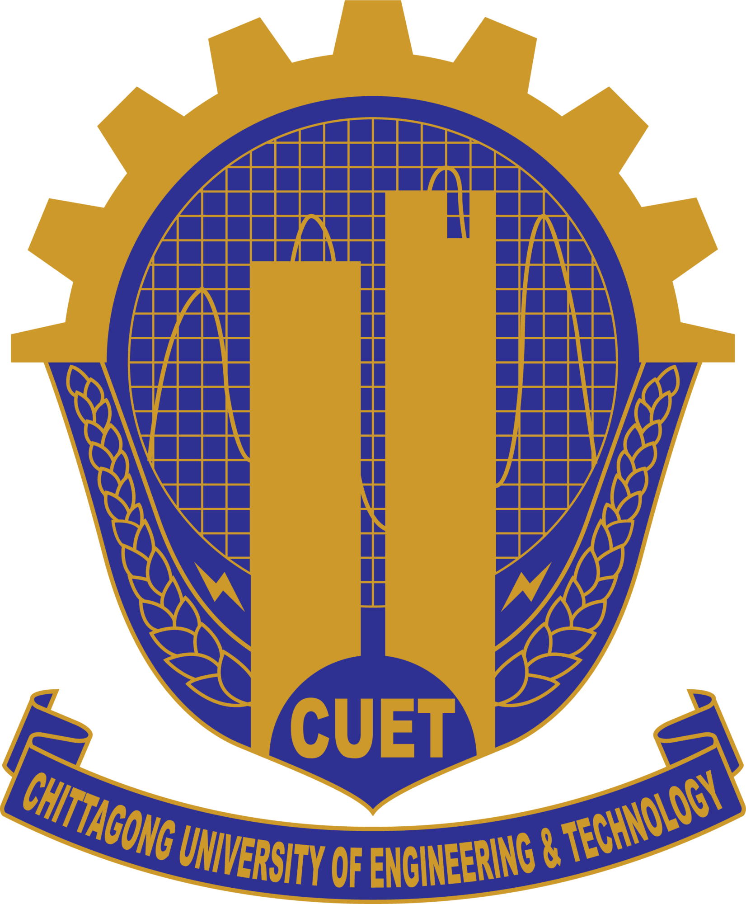
</p>

<p align="center">
  <strong>A custom edge-vision processor combining RISC-V programmability with hardware-accelerated image processing and TinyML inference</strong>
</p>

<p align="center">
  <a href="#architecture">
    
  </a>
  <a href="#features">
    
  </a>
  <a href="#fpga-implementation">
    
  </a>
  <a href="#asic-implementation">
    
  </a>
  <a href="#results">
    
  </a>
  <a href="#getting-started">
    
  </a>
</p>

---

## 📋 Table of Contents

- [Overview](#overview)
- [System Architecture](#system-architecture)
- [Key Features](#key-features)
- [Hardware Architecture](#hardware-architecture)
  - [RV32I 5-Stage Pipeline](#rv32i-5-stage-pipeline)
  - [Image Processing Unit (IPU)](#image-processing-unit-ipu)
  - [Memory Subsystem](#memory-subsystem)
  - [Camera & Display Interfaces](#camera--display-interfaces)
  - [TinyML Accelerator](#tinyml-accelerator)
- [Custom ISA Extensions](#custom-isa-extensions)
- [FPGA Implementation](#fpga-implementation)
  - [Basys-3 Board Setup](#basys-3-board-setup)
  - [Vivado Design Flow](#vivado-design-flow)
  - [Hardware Testing](#hardware-testing)
- [ASIC Implementation](#asic-implementation)
  - [OpenROAD Flow](#openroad-flow)
  - [Physical Design Results](#physical-design-results)
- [Results & Performance](#results--performance)
- [Project Structure](#project-structure)
- [Getting Started](#getting-started)
- [Future Work](#future-work)
- [Citation](#citation)
- [Acknowledgments](#acknowledgments)

---

## 🔭 Overview

**EVPIX-RV32** is a custom 5-stage pipelined RISC-V RV32I processor with hardware image-processing extensions, a streaming Image Processing Unit (IPU), and TinyML support built for real-time edge-vision AI acceleration. The architecture extends the RISC-V ISA with custom instructions for grayscale conversion, thresholding, Sobel edge detection, and 2D convolution in the custom-0 opcode space, connecting to an autonomous IPU that processes 128×128 frames at pixel-level parallelism.

The system was prototyped on the **Digilent Basys-3 AMD Artix-7 FPGA** with an **OV7670 camera** and dual-region VGA display, sustaining **60 FPS** with zero frame drops. A hardware Built-In Self-Test (BIST) mode runs 61 instructions and shows pass/fail results on the VGA monitor, while a TinyML finger-counting demo validates lightweight neural inference on the platform.

The design was synthesized through the open-source **OpenROAD flow** targeting **SkyWater 130-nm CMOS**, producing a DRC-clean, LVS-equivalent GDSII layout across **30.25 mm²**, operating at **100 MHz** with **3.24 mW** total power.

**Thesis:** Bachelor of Science (B.Sc.)  
**Department:** Electronics and Telecommunication Engineering  
**Institution:** Chittagong University of Engineering & Technology (CUET)  
**Author:** Ahasan Ullah Khalid (2008051)  
**Supervisor:** Md. Farhad Hossain, Assistant Professor, Department of ETE

---

## 🏗️ System Architecture

### Top-Level Architecture

<p align="center">
  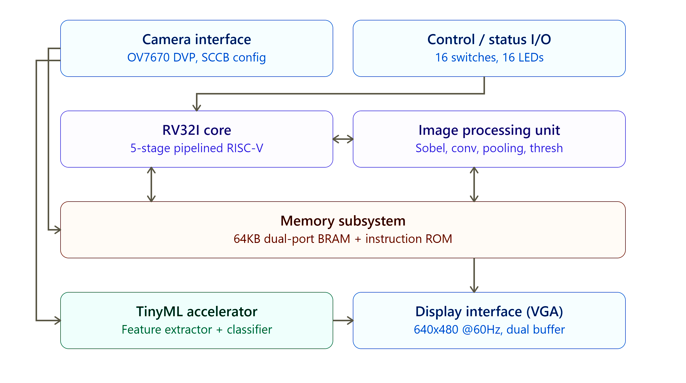
</p>

The EVPIX-RV32 system is a heterogeneous vision SoC that combines a general-purpose 32-bit RISC-V processor with dedicated image-processing hardware. The architecture uses a Harvard-style memory organization with separate instruction and data memories, plus a multi-port data memory that supports concurrent CPU and IPU access.

### System Components

| Component | Description |
|-----------|-------------|
| **RV32I Core** | 5-stage pipelined processor with full hazard detection and forwarding |
| **Image Processing Unit (IPU)** | Dedicated hardware accelerator for 7 image-processing operations |
| **Memory Subsystem** | 64KB unified data memory (dual-port BRAM) + Instruction ROM |
| **Camera Interface** | OV7670 parallel DVP with SCCB configuration (128×128 @ 30 FPS) |
| **Display Interface** | VGA controller (640×480 @ 60Hz) with dual-buffered frame display |
| **TinyML Accelerator** | Hardware feature extractor + classifier for finger-counting |
| **Control/Status I/O** | 16 slide switches, 16 LEDs for mode selection and status |

### Detailed System Block Diagram

<p align="center">
  
</p>

The system interconnect (AXI Bus) enables communication between the RV32I core, IPU, TinyML accelerator, unified data memory, and peripheral interfaces. The camera module feeds raw pixel data through the OV7670 DVP interface, while the VGA display controller outputs processed frames with real-time performance overlays.

---

## ✨ Key Features

- ✅ **Complete RV32I Base ISA** — All 40+ integer instructions with full forwarding and hazard detection
- ✅ **8 Custom Image-Processing Instructions** — GRAYSCALE, THRESH, SOBEL, CONV, VDOT, RELU, HACC, OTSU
- ✅ **7 Hardware-Accelerated IPU Operations** — Grayscale, Threshold, Sobel Edge, 2D Convolution, Max Pool, Avg Pool, Max Pixel
- ✅ **Real-Time 60 FPS Processing** — Zero frame drops at 128×128 resolution
- ✅ **Hardware BIST Mode** — 61-instruction regression with VGA pass/fail display
- ✅ **TinyML Finger Counting** — Real-time gesture recognition (0-5 fingers)
- ✅ **Open-Source ASIC Flow** — Complete RTL-to-GDSII using OpenROAD + SkyWater 130nm
- ✅ **Low Power** — 3.24 mW total power at 100 MHz in 130nm CMOS

---

## 🔧 Hardware Architecture

### RV32I 5-Stage Pipeline

<p align="center">
  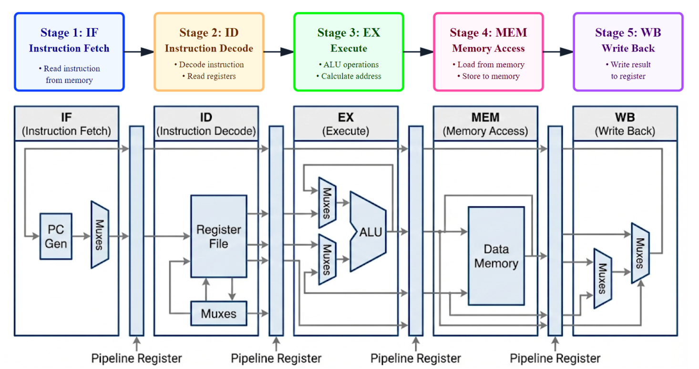
</p>

The processor implements a classic five-stage RISC pipeline with full hazard detection and data forwarding:

| Stage | Function | Key Components |
|-------|----------|----------------|
| **IF** — Instruction Fetch | Reads next instruction from memory | Program Counter, Instruction Memory, PC Incrementer |
| **ID** — Instruction Decode | Decodes instruction, reads registers | Register File (32×32-bit), Immediate Generator, Control Unit |
| **EX** — Execute | Performs ALU operations, branch decisions | ALU, Branch Comparator, Forwarding MUXes, IPU Interface |
| **MEM** — Memory Access | Reads/writes data memory | Data Memory, Load/Store Logic, Byte/Halfword/Word access |
| **WB** — Write Back | Writes results to register file | Result MUX (ALU/Mem/PC+4), Register File Write Port |

#### Pipeline Timing Diagram

<p align="center">
  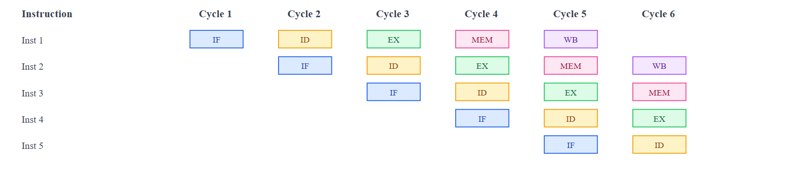
</p>

The pipeline achieves near-ideal IPC for sequential code with single-cycle branch resolution and full forwarding paths.

#### Individual Stage Diagrams

<p align="center">
  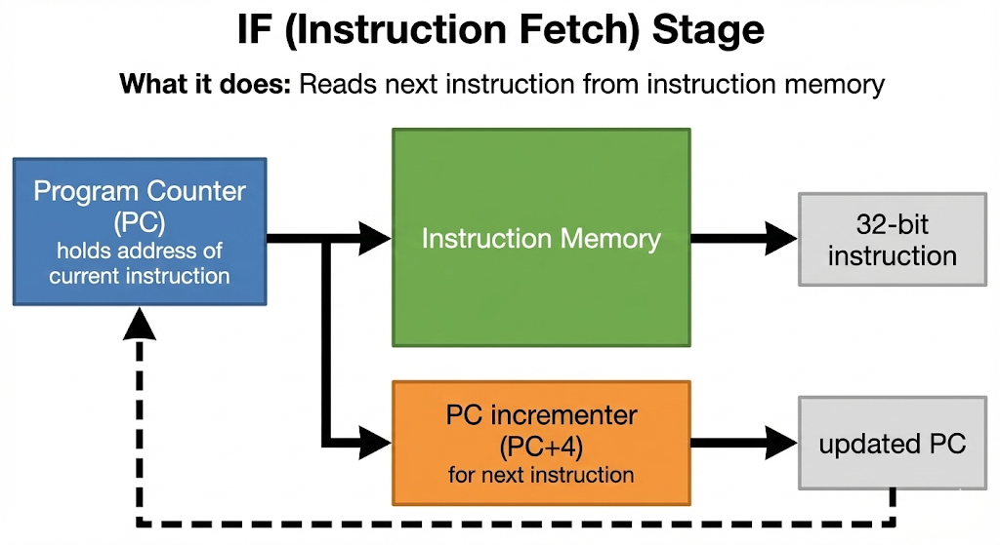
  <br/><em>Instruction Fetch (IF) Stage</em>
</p>

<p align="center">
  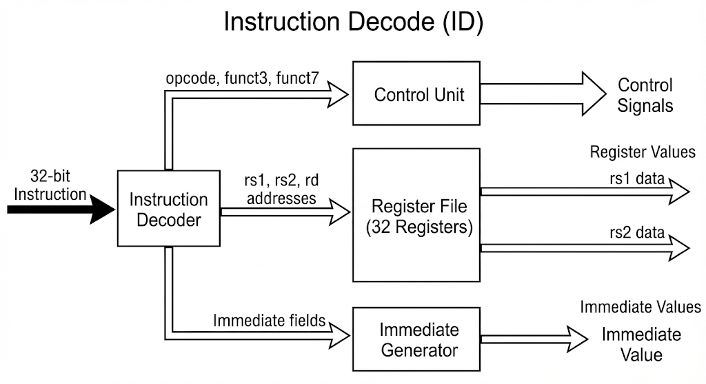
  <br/><em>Instruction Decode (ID) Stage</em>
</p>

<p align="center">
  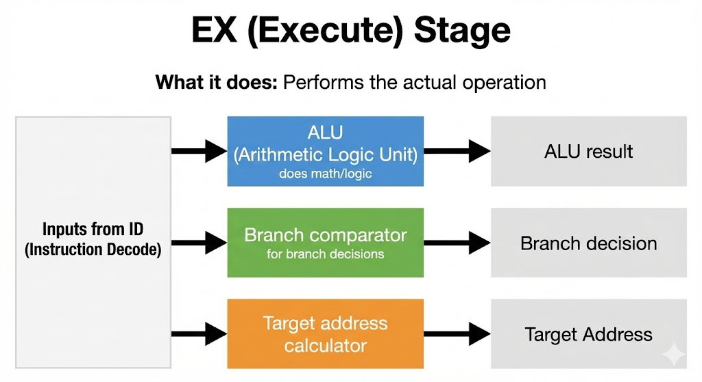
  <br/><em>Execute (EX) Stage</em>
</p>

<p align="center">
  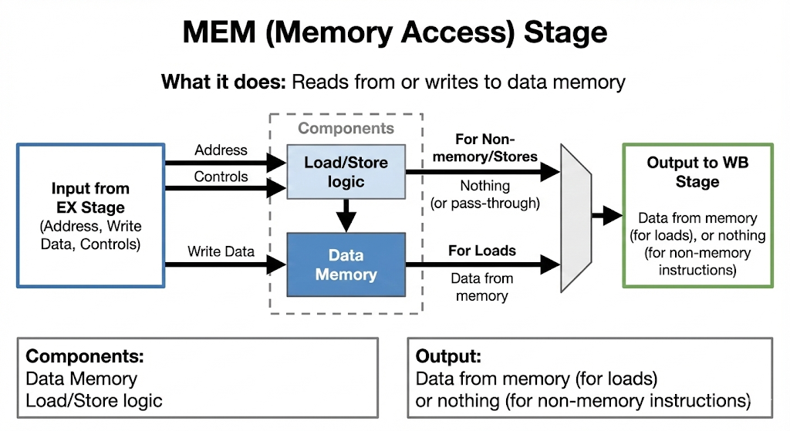
  <br/><em>Memory Access (MEM) Stage</em>
</p>

<p align="center">
  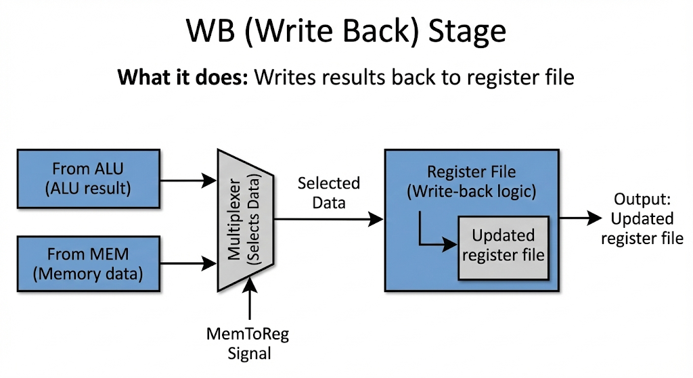
  <br/><em>Write Back (WB) Stage</em>
</p>

### Image Processing Unit (IPU)

<p align="center">
  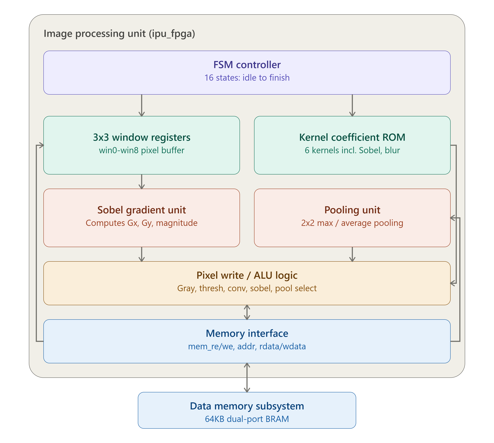
</p>

The IPU is a dedicated hardware accelerator controlled through custom R-type instructions. It features:

- **FSM Controller** — 16 states from idle to finish
- **3×3 Window Registers** — win0-win8 pixel buffer for convolution operations
- **Kernel Coefficient ROM** — 6 built-in kernels (Identity, Sobel X, Sobel Y, Gaussian Blur, Sharpen, Edge Detect)
- **Sobel Gradient Unit** — Computes Gx, Gy, and gradient magnitude
- **Pooling Unit** — 2×2 max/average pooling
- **Pixel Write/ALU Logic** — Gray, thresh, conv, sobel, pool selection
- **Memory Interface** — Direct dual-port BRAM access

#### Supported IPU Operations

| Operation | Description | Performance (128×128 @ 100MHz) |
|-----------|-------------|-------------------------------|
| **Grayscale** | RGB to luminance: Y = (77R + 150G + 29B) >> 8 | **1,525 FPS** |
| **Threshold** | Binary threshold at configurable level | **1,525 FPS** |
| **Max Pixel** | Finds maximum pixel value in image | **1,525 FPS** |
| **Sobel Edge** | 3×3 gradient magnitude computation | **1,525 FPS** |
| **2D Convolution** | Programmable kernel convolution | **1,220 FPS** |
| **Max Pool** | Non-overlapping 2×2 max pooling | **1,220 FPS** |
| **Avg Pool** | Non-overlapping 2×2 average pooling | **4,882 FPS** |

### Memory Subsystem

The memory map is organized as follows:

| Address Range | Size | Content |
|--------------|------|---------|
| `0x0000_0000` – `0x0000_BFFF` | 48 KB | 128×128 RGB888 Source Image Buffer |
| `0x0000_C000` – `0x0000_FFFF` | 16 KB | 128×128 8-bit Processed Output Buffer |

The 64KB unified data memory uses dual-port BRAM supporting concurrent CPU load/store and IPU direct memory access.

### Camera & Display Interfaces

#### OV7670 Camera Module

<p align="center">
  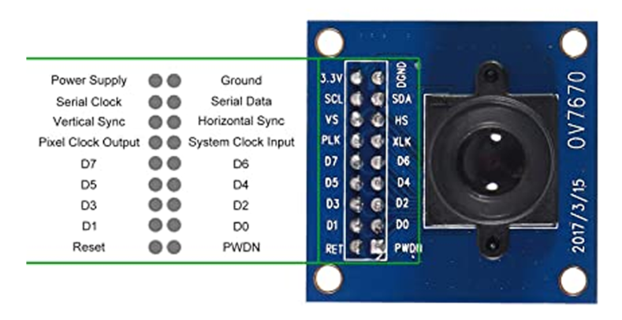
</p>

The OV7670 CMOS camera module connects via parallel DVP interface with:
- 8-bit pixel data bus
- PCLK (pixel clock), HREF (horizontal sync), VSYNC (vertical sync)
- SCCB (I2C-compatible) configuration bus
- 128×128 resolution at 30 FPS native capture rate

#### VGA Display Interface

<p align="center">
  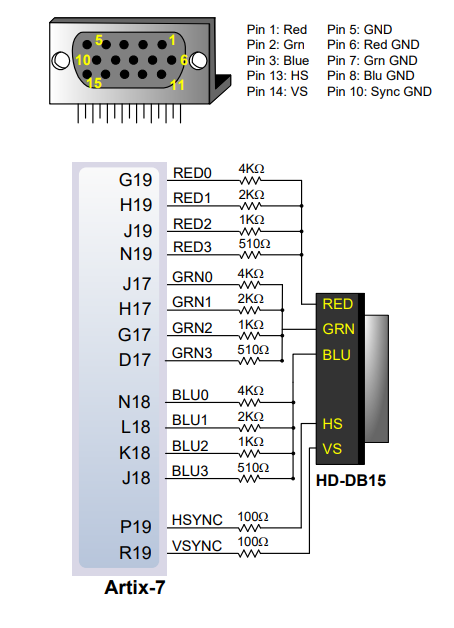
</p>

The Basys-3 VGA interface provides:
- 12-bit RGB (4-bit per channel) via resistor-DAC network
- 640×480 @ 60Hz standard timing
- Dual-region display: original frame (left) + processed frame (right)
- On-screen performance overlays (FPS, cycle counts, mode status)

### TinyML Accelerator

<p align="center">
  
</p>

The TinyML subsystem includes:
- **Hardware Feature Extractor** — Skin-color detection and finger-region segmentation
- **Classifier** — Quantized neural network for finger-counting (0-5 classes)
- **Temporal Stability Filter** — Reduces jitter between frames
- **Integration** — Results overlaid on VGA display in real-time

---

## 📝 Custom ISA Extensions

The processor extends RV32I with 8 custom instructions encoded in the **custom-0 opcode space (`0001011`)**:

| Instruction | Opcode | funct3 | funct7 | Description |
|-------------|--------|--------|--------|-------------|
| `GRAYSCALE` | `0001011` | `000` | `kernel[3:0]`, `op=0` | Convert RGB to grayscale |
| `THRESH` | `0001011` | `000` | `kernel[3:0]`, `op=1` | Apply binary threshold |
| `SOBEL` | `0001011` | `000` | `kernel[3:0]`, `op=2` | Sobel edge detection |
| `CONV` | `0001011` | `000` | `kernel[3:0]`, `op=3` | 2D convolution with kernel |
| `VDOT` | `0001011` | `001` | — | Vector dot product for ML |
| `RELU` | `0001011` | `010` | — | Rectified linear activation |
| `HACC` | `0001011` | `011` | — | Histogram accumulation |
| `OTSU` | `0001011` | `100` | — | Otsu threshold calculation |

The `funct3` field selects the IPU operation type (START, STATUS, RESULT, PERF), while `funct7` selects the algorithm and kernel. This encoding maintains full compatibility with standard RV32I tools and compilers.

---

## 🖥️ FPGA Implementation

### Basys-3 Board Setup

<p align="center">
  
</p>

The **Digilent Basys-3** development board features:
- **FPGA:** Xilinx Artix-7 XC7A35T-1CPG236C
  - 33,280 LUTs | 66,400 FFs | 90 BRAMs (1,800 Kb) | 90 DSP48E1 slices
- **Clock:** 100 MHz onboard oscillator
- **I/O:** 16 slide switches, 16 LEDs, 5 pushbuttons, 4-digit 7-segment display
- **Display:** VGA port (12-bit RGB)
- **Expansion:** 4 Pmod connectors
- **Programming:** USB-JTAG via shared UART/JTAG port

#### Board Component Layout

<p align="center">
  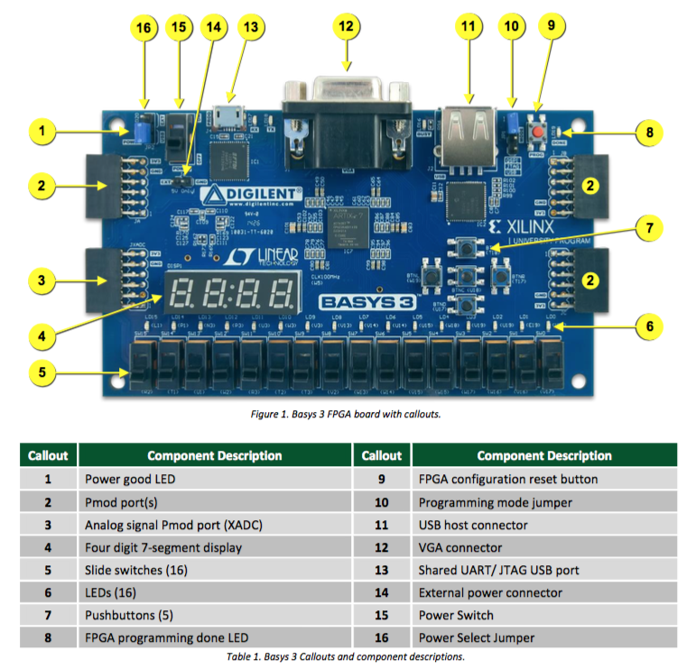
</p>

| Callout | Component | Use in EVPIX-RV32 |
|---------|-----------|-------------------|
| 1 | Power Good LED | Power status indicator |
| 2 | Pmod Ports | OV7670 camera connection |
| 3 | Analog Pmod (XADC) | — |
| 4 | 7-Segment Display | Performance counters |
| 5 | Slide Switches (16) | Mode selection (CPU/IPU/BIST/TinyML) |
| 6 | LEDs (16) | Status indicators |
| 7 | Pushbuttons (5) | Reset, user input |
| 8 | FPGA Programming Done LED | Configuration status |
| 9 | FPGA Configuration Reset | Hardware reset |
| 10 | Programming Mode Jumper | JTAG/SPI selection |
| 11 | Shared UART/JTAG USB | Programming and debug |
| 12 | VGA Connector | Monitor output |
| 13 | Shared UART/JTAG USB | Alternative programming |
| 14 | External Power Connector | — |
| 15 | Power Switch | Board power |
| 16 | Power Select Jumper | USB/External power |

### Physical Prototype Setup

<p align="center">
  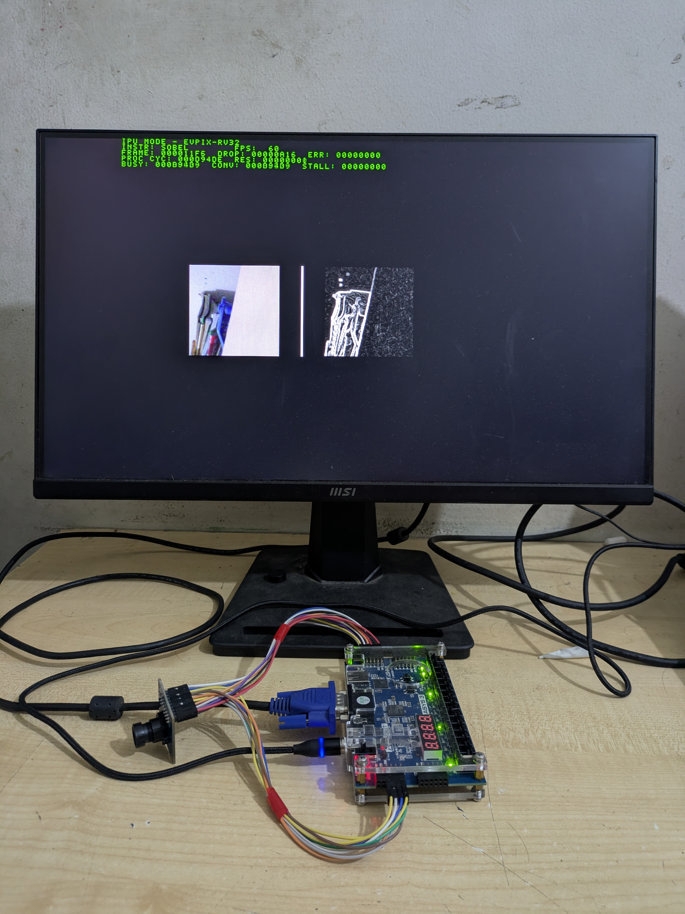
</p>

The physical prototype connects:
- **OV7670 camera** → Pmod-compatible breakout → Basys-3 Pmod port
- **VGA monitor** → Basys-3 VGA port via DB15 cable
- **USB power** → Basys-3 micro-USB for power and programming

### Vivado Design Flow

<p align="center">
  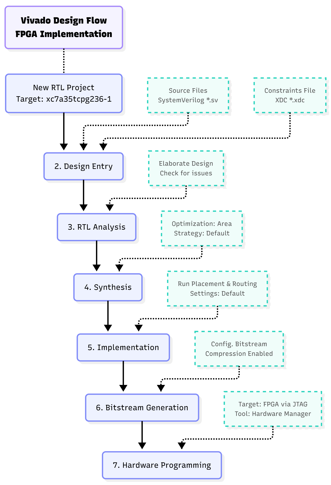
</p>

The FPGA implementation follows the standard Xilinx Vivado flow:

```
1. New RTL Project → Target: xc7a35tcpg236-1
2. Design Entry → Add SystemVerilog (*.sv) sources + XDC constraints
3. RTL Analysis → Elaborate design, check for issues
4. Synthesis → Area optimization, default strategy
5. Implementation → Placement & Routing, default settings
6. Bitstream Generation → Compression enabled
7. Hardware Programming → FPGA via JTAG (Hardware Manager)
```

#### FPGA Resource Utilization

<p align="center">
  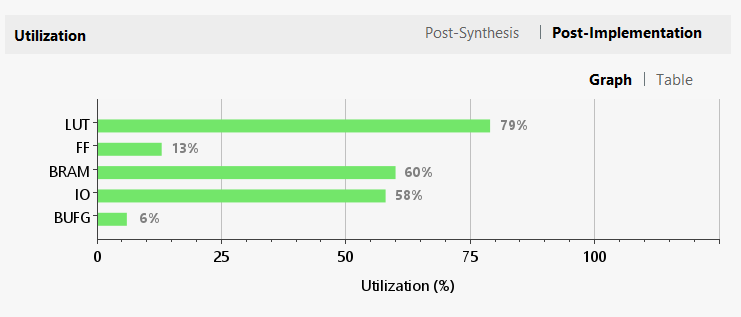
</p>

| Resource | Used | Available | Utilization |
|----------|------|-----------|-------------|
| **Slice LUTs** | 16,547 | 20,800 | **79.55%** |
| **Slice Registers** | 5,534 | 41,600 | 13.30% |
| **Block RAM Tile** | 30 | 50 | **60.00%** |
| **DSP Slices** | 0 | 90 | 0.00% |
| **Clock Buffers (BUFG)** | 2 | 32 | 6.25% |
| **Bonded IOB** | 62 | 106 | 58.49% |

> **Note:** All arithmetic is LUT-based (no DSP slices) for maximum portability across FPGA families and clean ASIC synthesis.

#### FPGA Power Consumption

<p align="center">
  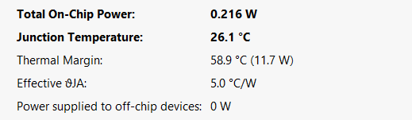
</p>

| Metric | Value |
|--------|-------|
| Total On-Chip Power | **216.0 mW** |
| Dynamic Power | 142.0 mW (66%) |
| Device Static Power | 73.0 mW (34%) |
| BRAM Power | 46.0 mW (32% of dynamic) |
| Logic Power | 31.0 mW (22% of dynamic) |
| Signals Power | 27.0 mW (19% of dynamic) |
| I/O Power | 19.0 mW (14% of dynamic) |
| Clocks Power | 19.0 mW (13% of dynamic) |
| Junction Temperature | 26.1°C |
| Thermal Margin | 58.9°C (11.7 W) |

### Hardware Testing & Modes

The system supports multiple operating modes controlled by slide switches:

| SW0 | SW1-SW6 | SW7 | Mode | Description |
|-----|---------|-----|------|-------------|
| 0 | 0 | 0 | **CPU Welcome** | System info display |
| 0 | 0 | 1 | **CPU BIST** | RV32I instruction regression test |
| 1 | 1 | 0 | **IPU Sobel** | Real-time edge detection |
| 1 | 2 | 0 | **IPU Grayscale** | Real-time grayscale conversion |
| 1 | 3 | 0 | **IPU Threshold** | Real-time binary thresholding |
| 1 | 4 | 0 | **IPU Convolution** | Real-time filter convolution |
| 1 | — | 1 | **TinyML** | Finger-counting gesture recognition |

#### BIST Mode — VGA Output

<p align="center">
  
</p>

The hardware BIST mode runs 61 instructions covering all RV32I base instructions and IPU kernels, displaying pass/fail status directly on the VGA monitor:

```
CPU BIST MODE - RV32I BASELINE
ALL BASELINE CHECKS PASSED
TEST    EXP        GOT        RESULT
ADDI X1  0000000A  0000000A  PASS
ADDI X2  FFFFFFD   FFFFFFD   PASS
...
JAL  X29 000000EC  000000EC  PASS
JALR X30 00000060  00000060  PASS
```

#### Real-Time Image Processing Results

<p align="center">
  
</p>

| Mode | Left Panel (Source) | Right Panel (Processed) |
|------|---------------------|------------------------|
| (a) Sobel Edge Detection | Color camera feed | Edge-detected output |
| (b) Grayscale Conversion | Color camera feed | Grayscale output |
| (c) Image Thresholding | Color camera feed | Binary threshold output |
| (d) Convolution Filtering | Color camera feed | Filtered output (sharpen/blur) |

#### TinyML Finger Counting Results

<p align="center">
  
</p>

| Detection | Fingers Counted | Accuracy |
|-----------|-----------------|----------|
| (a) 1 Finger Detected | 1 | Real-time |
| (b) 2 Fingers Detected | 2 | Real-time |
| (c) 3 Fingers Detected | 3 | Real-time |
| (d) 5 Fingers Detected | 5 | Real-time |

**TinyML Performance Metrics:**
- Overall Classification Accuracy: **70%** (7/10 correct)
- False Positive Rate: 20%
- False Negative Rate: 10%
- Classification Latency: 1 frame (real-time, no buffering)

---

## 🔬 ASIC Implementation

### OpenROAD Flow

<p align="center">
  
</p>

The ASIC implementation uses the fully open-source **OpenROAD** EDA flow with the **SkyWater 130-nm CMOS PDK**:

```
Phase 1: RTL Design & IP Integration
    ↓
Phase 2: Functional Verification (Simulation + FPGA)
    ↓
Phase 3: FPGA Prototyping
    ├── Design Entry & RTL Analysis
    ├── Synthesis & Optimization
    ├── Implementation: Place & Route
    └── Bitstream Gen & Programming
    ↓
FPGA Validated ✓ → Validated RTL & Constraints
    ↓
Phase 4: ASIC Implementation (OpenROAD)
    ├── Synthesis (Yosys)
    ├── Floorplan & PDN (Macro placement)
    ├── Placement (Global & Detail)
    ├── Physical Verification (DRC & LVS)
    ├── CTS & Routing (Clock tree synthesis)
    └── GDSII Export
    ↓
GDSII for Fabrication
```

#### Technology Selection: SkyWater 130nm

<p align="center">
  
</p>

**Why SkyWater 130nm?**
- ✅ Fully open-source (Apache 2.0 license)
- ✅ Mature, robust process with extensive documentation
- ✅ 583 standard cells in SKY130_FD_SC_HD library
- ✅ Compatible with OpenROAD automated flow
- ✅ Active community + Open MPW shuttle programs
- ✅ Educational accessibility over cutting-edge performance

### Physical Design Results

#### Synthesis Results (Yosys)

| Metric | Value |
|--------|-------|
| Total Standard Cell Area | **159,490.46 µm²** |
| Equivalent NAND2 Gate Count | **42,490 gates** |
| Total Wire Count | 28,023 |
| Sequential Cells (DFFs) | 2,336 (10.4%) |
| Combinational Cells | 20,064 (89.6%) |

#### Floorplan & Die Statistics

<p align="center">
  
</p>

| Metric | Value |
|--------|-------|
| Die Width × Height | 5500.00 × 5500.00 µm |
| **Total Die Area** | **30.250 mm²** |
| Core Utilization | 50% (target) |
| Aspect Ratio | 1.00:1 (square) |

#### Clock Tree Synthesis (TritonCTS)

| Metric | Value |
|--------|-------|
| Global Clock Skew | **0.77 ps** |
| Maximum Clock Latency | 2.5024 ps |
| Minimum Clock Latency | 2.5066 ps |
| Clock Buffers Inserted | 394 |

#### Routing Results

<p align="center">
  
</p>

| Metric | Value |
|--------|-------|
| Total Wirelength | **2.354 meters** |
| Routing Layers Used | M1, M2, M3, M4, M5 |
| Final DRC Violations | **0 (CLEAN)** |

#### Static Timing Analysis (OpenSTA)

| Metric | Value |
|--------|-------|
| Worst Setup Slack | **+41.768 ns** |
| Worst Hold Slack | **+0.320 ns** |
| Critical Path Delay | 53.232 ns |
| **Maximum Operating Frequency** | **100.0 MHz** |
| Setup Violations | 0 |
| Hold Violations | 0 |

> ✅ **Timing closure achieved with positive slack at 100 MHz target!**

#### Power Analysis

<p align="center">
  
</p>

| Metric | Value |
|--------|-------|
| Leakage Power | 0.095 µW |
| Internal Power | 2,020.000 µW |
| Switching Power | 1,220.000 µW |
| **Total Power Consumption** | **3.240 mW** |

**Power breakdown:** The design achieves excellent power efficiency for edge-vision applications, with total consumption under 3.5 mW at 100 MHz — suitable for battery-powered and energy-harvesting deployments.

### Physical Verification Signoff

| Check | Status | Details |
|-------|--------|---------|
| **DRC** | ✅ CLEAN | 0 violations |
| **LVS** | ✅ EQUIVALENT | Netlist matches layout |
| **Antenna Check** | ✅ PASS | 0 violations |
| **Metal Density** | ✅ COMPLIANT | All layers within SKY130 limits |

### GDSII Layout Views

<p align="center">
  
  <br/><em>Full-chip GDSII layout with core area, IO ring, power network, and clock tree</em>
</p>

<p align="center">
  
  <br/><em>Zoomed-in core layout showing standard cell placement density</em>
</p>

<p align="center">
  
  <br/><em>Transistor-level zoom of standard cell implementation</em>
</p>

<p align="center">
  
  <br/><em>Right-side I/O pad ring with signal, power, and ground pads</em>
</p>

<p align="center">
  
  <br/><em>Detailed routing view showing metal interconnect layers</em>
</p>

---

## 📊 Results & Performance

### Functional Verification

| Test | Method | Result |
|------|--------|--------|
| RV32I Instruction BIST | Simulation + Hardware | **100% PASS** (61/61 instructions) |
| IPU Operation Tests | Simulation + Hardware | **100% PASS** (7/7 operations) |
| Performance Counters | Simulation | **100% PASS** (all counters match) |
| TinyML Finger Count | Hardware | **70% accuracy** (real-time) |

### IPU Processing Performance

| Operation | Cycles | Time (ms) | Max FPS |
|-----------|--------|-----------|---------|
| Grayscale | 65,538 | 0.655 | **1,525** |
| Threshold | 65,538 | 0.655 | **1,525** |
| Sobel Edge | 65,538 | 0.655 | **1,525** |
| Gaussian Blur | 81,922 | 0.819 | **1,220** |
| Sharpen | 81,922 | 0.819 | **1,220** |
| Max Pool | 81,922 | 0.819 | **1,220** |
| Avg Pool | 20,482 | 0.205 | **4,882** |

### End-to-End System Performance

| Metric | Value |
|--------|-------|
| Camera Capture Rate | 30 FPS (OV7670 native) |
| Processing Rate (Sobel) | **60 FPS** (frame-doubled) |
| Display Refresh Rate | 60 Hz (VGA 640×480) |
| End-to-End Latency | 16.7 ms |
| Frame Drop Rate | **0.0%** |

### FPGA vs ASIC Comparison

| Metric | FPGA (Artix-7) | ASIC (SkyWater 130nm) |
|--------|---------------|----------------------|
| Frequency | ~70 MHz (timing limited) | **100 MHz** (clean closure) |
| Power | 216 mW | **3.24 mW** |
| Area | 16,547 LUTs | 30.25 mm² die |
| Technology | 28nm FPGA fabric | 130nm CMOS |
| BRAM | 30 tiles (60%) | SRAM macros |

### Comparison with Related Work

| Platform | Tech. | Pipeline | Vision Accel. | AI Accel. | Open | Vision I/O |
|----------|-------|----------|---------------|-----------|------|------------|
| **EVPIX-RV32** (This work) | **130nm** | **5-stage** | **IPU (7 ops)** | **TinyML** | **Yes** | **OV7670/VGA** |
| PULPino | 65nm | 4-stage | None | None | Yes | None |
| Ibex | 22nm | 2-stage | None | None | Yes | None |
| Rocket Chip | 45nm | 5-stage | RoCC only | None | Yes | None |
| GAP8 | 55nm | 1+8 cluster | HWCE | 8-core CNN | Partial | PulpCam |
| Eyeriss | 65nm | — | None | CNN | No | None |
| TinyVers | 22nm | 2-stg+NPU | None | Reconf. NPU | No | None |
| Commercial Edge AI | 40-90nm | Cortex-M | None | NPU | No | None |

---

## 📁 Project Structure

```
evpix_rv32/
├── rtl/                          # SystemVerilog RTL source files
│   ├── core/                     # RV32I processor core
│   │   ├── rv32i_top.sv          # Top-level processor module
│   │   ├── if_stage.sv           # Instruction Fetch
│   │   ├── id_stage.sv           # Instruction Decode
│   │   ├── ex_stage.sv           # Execute (with custom instr.)
│   │   ├── mem_stage.sv          # Memory Access
│   │   ├── wb_stage.sv           # Write Back
│   │   ├── hazard_unit.sv        # Hazard detection & forwarding
│   │   ├── register_file.sv      # 32×32-bit register file
│   │   └── alu.sv                # 32-bit ALU
│   ├── ipu/                      # Image Processing Unit
│   │   ├── ipu_top.sv            # IPU top module
│   │   ├── ipu_fsm.sv            # 16-state FSM controller
│   │   ├── sobel_unit.sv         # Sobel gradient computation
│   │   ├── conv_unit.sv          # 2D convolution engine
│   │   ├── pool_unit.sv          # Max/avg pooling
│   │   └── kernel_rom.sv         # Kernel coefficient ROM
│   ├── memory/                   # Memory subsystem
│   │   ├── data_memory.sv        # 64KB dual-port BRAM
│   │   └── instr_rom.sv          # Instruction ROM
│   ├── peripherals/              # I/O interfaces
│   │   ├── camera_interface.sv   # OV7670 DVP interface
│   │   ├── vga_controller.sv     # VGA 640×480 @ 60Hz
│   │   └── display_overlay.sv    # On-screen text overlay
│   ├── tinyml/                   # TinyML accelerator
│   │   ├── feature_extractor.sv  # Hardware feature extraction
│   │   └── classifier.sv         # Quantized NN classifier
│   └── top/                      # System integration
│       └── evpix_rv32_top.sv     # Complete SoC top level
├── sim/                          # Simulation testbenches
│   ├── tb_rv32i_core.sv          # RV32I core testbench
│   ├── tb_ipu_system.sv          # IPU system testbench
│   └── tb_full_system.sv         # Full SoC testbench
├── fpga/                         # FPGA implementation
│   ├── basys3_constraints.xdc    # Basys-3 pin constraints
│   ├── vivado_project/           # Vivado project files
│   └── bitstream/                # Generated bitstreams
├── asic/                         # ASIC implementation
│   ├── openlane_config/          # OpenLane configuration
│   ├── sdc/                      # Timing constraints
│   ├── gdsii/                    # Final GDSII layout
│   └── reports/                  # Synthesis, timing, power reports
├── firmware/                     # Software programs
│   ├── bist/                     # Built-In Self-Test programs
│   ├── ipu_tests/                # IPU operation test programs
│   └── tinyml_model/             # Quantized finger-count model
├── images/                       # Documentation images
│   ├── architecture/             # Architecture diagrams
│   ├── fpga/                     # FPGA photos and screenshots
│   ├── asic/                     # ASIC layout views
│   └── results/                  # Performance result plots
├── docs/                         # Documentation
│   ├── thesis.pdf                # Full thesis document
│   └── presentations/            # Defense slides
├── tools/                        # Helper scripts
│   ├── hex_gen.py                # Memory initialization generator
│   └── kernel_gen.py             # Convolution kernel generator
├── Makefile                      # Build automation
├── README.md                     # This file
└── LICENSE                       # Apache 2.0 License
```

---

## 🚀 Getting Started

### Prerequisites

#### For FPGA Prototyping:
- Xilinx Vivado 2023.1 or later (free WebPACK license for Artix-7)
- Digilent Basys-3 board
- OV7670 camera module with breakout board
- VGA monitor + cable
- USB-A to micro-B cable

#### For ASIC Synthesis:
- OpenLane 2.x (via Nix or Docker)
- SkyWater 130nm PDK (auto-downloaded by OpenLane)
- Yosys 0.35+
- OpenROAD (included in OpenLane)
- Magic, KLayout, Netgen (for signoff)

### FPGA Quick Start

```bash
# Clone the repository
git clone https://github.com/aukhalid/evpix_rv32.git
cd evpix_rv32

# Open Vivado and create project with Basys-3 constraints
# Or use the provided Tcl script:
vivado -source fpga/vivado_project/create_project.tcl

# Run synthesis, implementation, and generate bitstream
# Program the Basys-3 board via JTAG

# Connect OV7670 camera to Pmod port and VGA monitor
# Power on and use switches to select operating mode
```

### ASIC Quick Start

```bash
# Using OpenLane Docker container
cd asic/openlane_config

# Run the complete RTL-to-GDSII flow
make evpix_rv32

# View results
klayout ../gdsii/evpix_rv32.gds

# Check reports
cat ../reports/final_summary_report.csv
```

### Simulation

```bash
# Run RV32I core testbench
make sim_core

# Run IPU system testbench
make sim_ipu

# Run full system testbench
make sim_system
```

---

## 🔮 Future Work

1. **Compiler Support** — GCC/LLVM backend with custom instruction intrinsics
2. **DMA Engine** — Lightweight DMA for autonomous data movement
3. **Higher Resolution** — QVGA (320×240) and VGA (640×480) support with external memory
4. **Advanced IPU Kernels** — Morphological operations, histogram equalization, motion estimation
5. **Native TinyML** — Port finger-counting model to run entirely on EVPIX-RV32 CPU/IPU
6. **Formal Verification** — SVA assertions and model checking for pipeline correctness
7. **Advanced Node ASIC** — Migration to 65nm or 28nm for area/power reduction
8. **Multi-Core Extension** — Dual-core heterogeneous configuration

---

## 📖 Citation

If you use EVPIX-RV32 in your research, please cite:

```bibtex
@thesis{khalid2026evpix,
  author    = {Khalid, Ahasan Ullah},
  title     = {{EVPIX-RV32: 5-Stage Custom RISC-V SoC with Integrated IPU and TinyML Support for Real-Time Edge-Vision AI Acceleration}},
  school    = {Chittagong University of Engineering and Technology},
  year      = {2026},
  type      = {Bachelor's Thesis},
  department = {Electronics and Telecommunication Engineering},
  address   = {Chattogram-4349, Bangladesh}
}
```

---

## 🙏 Acknowledgments

- **Supervisor:** Md. Farhad Hossain, Assistant Professor, ETE Department, CUET
- **Institution:** Chittagong University of Engineering & Technology (CUET)
- **Open-Source Community:** RISC-V International, OpenROAD Project, SkyWater PDK, YosysHQ
- **Tools:** Xilinx Vivado, Digilent Basys-3, OpenLane, Magic, KLayout

---

## 📄 License

This project is licensed under the **Apache 2.0 License** — see the [LICENSE](LICENSE) file for details.

The RISC-V ISA is an open standard maintained by RISC-V International. The SkyWater 130nm PDK is provided under the Apache 2.0 license by Google and SkyWater Technology.

---

<p align="center">
  <strong>Built with ❤️ at CUET | Open Source | Open Silicon | Open Education</strong>
</p>

<p align="center">
  <a href="https://github.com/aukhalid/evpix_rv32">⭐ Star this repo</a> •
  <a href="https://github.com/aukhalid/evpix_rv32/issues">🐛 Report Issues</a> •
  <a href="https://github.com/aukhalid/evpix_rv32/pulls">🔀 Contribute</a>
</p>
